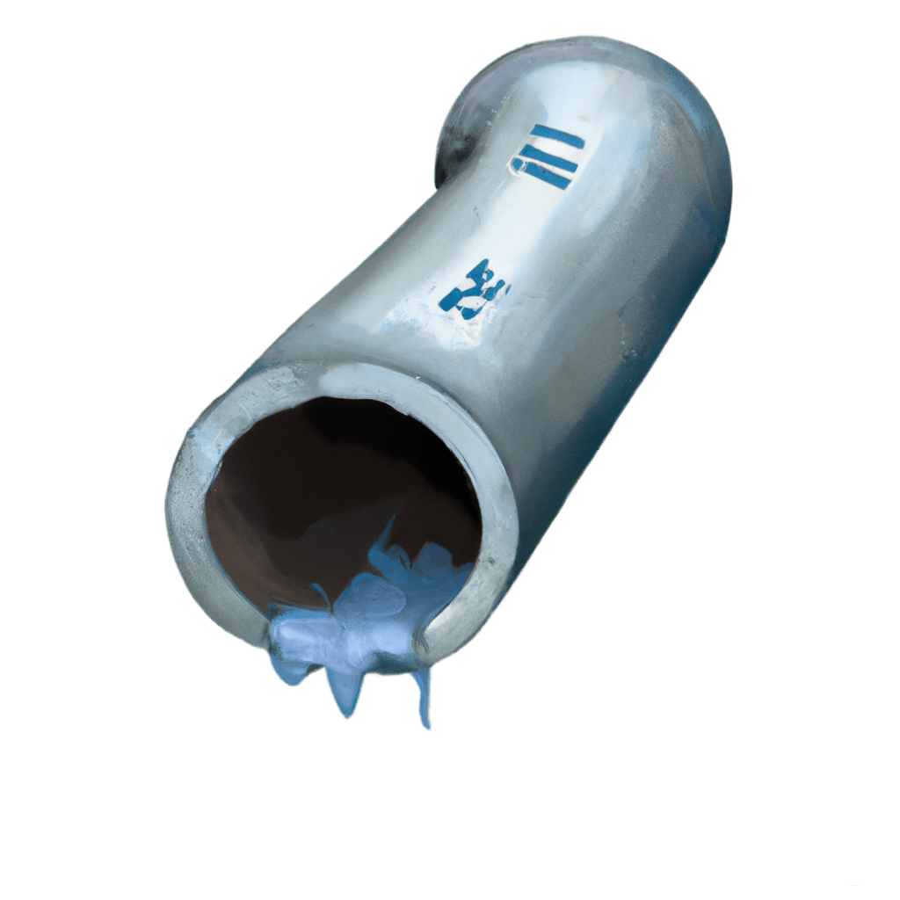

<div align="center">
    
	<h1>Tailpipe</h1>
    <h3>Tailwind CSS variables in PHP</h3><br />
	<div>
		<a 
			href="https://github.com/Capevace/tailpipe/actions/workflows/test.yml"
		>
			
		</a>
		<a href="https://github.com/Capevace/tailpipe/actions/workflows/test.yml">
			
		</a>
		
	</div>
	<h6><em>Made by <a href="https://mateffy.me">Lukas Mateffy</a></em></h6>

</div>
<br />

```php
<?php

$green500 = tailpipe('colors.green.500');
// -> #059669

$margin = tailpipe('spacing.4');
// -> 1rem

$primary = tailpipe('colors.primary.500');
// -> #your-theme-color
```

## Features

- Access Tailwind CSS variables in your PHP code
- Automatically generated .php file containing the variables
- Uses a Tailwind plugin, so it updates on every build
- Integrations for Laravel, but can also be used in other PHP frameworks
- [Common variables](#enabling-more-variables) are enabled by default, but you can [enable more variables](#enabling-more-variables) if you want

<br />

Tailpipe is a PHP package that enables you to access Tailwind CSS variables in your PHP code. It is an extension for Tailwind CSS that generates a .php file containing the variables, which can then be used in your PHP application. This allows you to keep your styling consistent across both your CSS and PHP code, making your application more maintainable and organized.

It also provides tight integration with Laravel, allowing you to access the variables using a global helper function, a facade, or a Blade directive.

<br />

---

<br />

- [Features](#features)
- [Installation](#installation)
  - [Package Installation](#package-installation)
  - [Tailwind CSS Plugin Installation](#tailwind-css-plugin-installation)
    - [Enabling more variables](#enabling-more-variables)
- [Usage](#usage)
  - [Helper function](#helper-function)
  - [Facade](#facade)
  - [Blade directive](#blade-directive)
  - [Using the Tailpipe class](#using-the-tailpipe-class)
- [Options](#options)
  - [`parse: true`](#parse-bool)
  - [Required setup for non-Laravel projects](#required-setup-for-non-laravel-projects)
- [Required setup for non-Laravel projects](#required-setup-for-non-laravel-projects)

<br />

## Installation

To install the Tailpipe package, you will need to install both the Laravel package `capevace/tailpipe` and the Tailwind CSS plugin JS package `@capevace/tailpipe`.

<br />

### PHP Package Installation

1. Install the package using Composer:

```
composer require capevace/tailpipe
```

2. The package will automatically register its service provider and facade in your Laravel application, if you're using it.

<br />

### Tailwind CSS Plugin Installation

1. Install the package using npm or yarn:

```
npm install @capevace/tailpipe
```

2. Add the plugin to your `tailwind.config.js` file:

```js
// tailwind.config.js

module.exports = {
  plugins: [
    // ..other plugins
    require('@capevace/tailpipe')
  ],
};
```

This will configure the plugin to generate a `tailpipe.php` file in your `resources/css` directory, containing the theme variables.

<br />

## Usage

Tailpipe exposes a `tailpipe()` helper function, which you can use to access the variables in your PHP code. It also provides tight integration with Laravel, allowing you to access the variables using a facade or a Blade directive.

### Helper function

You can use the `tailpipe()` helper function like this:

```php
// Using the global helper function
$yellow500 = tailpipe('colors.yellow.500');
// -> #fbbf24
```

### Facade
Using a Facade:

```php
// Using the facade
use Tailpipe\Facades\Tailpipe;

$yellow500 = Tailpipe::get('colors.yellow.500');
// -> #fbbf24
```

### Blade directive

You can also use the `@tailpipe` Blade directive:

```html
{{-- view.blade.php --}}

<div
    x-data="{ color: '@tailpipe('colors.yellow.500')' }"
></div>
```

### Using the Tailpipe class

If you want to use the Tailpipe class directly, you can do so like this:

```php
// Using the Tailpipe class
use Tailpipe\Tailpipe;

$yellow500 = (new Tailpipe)->get('colors.yellow.500');
```

<br />

## Options

The `tailpipe()` helper function accepts the following options:

### `parse: bool`

If `parse` is set to `true`, the value will be parsed and returned as a string without units. This is useful if you want to use the value in a script or to calculate with it, for example.

```php
$yellow500 = tailpipe('colors.yellow.500', parse: true);
// -> 'fbbf24', without the `#`

$spacing = tailpipe('screens.md', parse: true) / 2;
// -> 768 (integer without the `px`) / 2 = 384
```

The following values will be parsed:

| Type | Example Input (string) | Example Output |
| --- | --- | --- |
| hex codes | `"#fbbf24"` | `"fbbf24"`: string |
| integers | `"768px"` | `768`: int |
| floats | `"0.5"` | `0.5`: float |
| percentages | `"50%"` | `0.5`: float | 

Numbers will be parsed from the following units: `px`, `rem`, `em`, `vh`, `vw`, `vmin`, `vmax`, `ms`, `s`, `%`, `deg`, `rad`, `turn`.

<br />

### Required setup for non-Laravel projects

By default, the plugin will generate a `tailpipe.php` file in your `resources/css` directory. The path is determined using Laravel's `resource_path` function. 

**If you're not using Laravel, you can have to set the `outputPath` option to a custom path:**


```js
// tailwind.config.js

const tailpipe = require('@capevace/tailpipe');

module.exports = {
  plugins: [
    // ..other plugins
    tailpipe({
        outputPath: 'path/to/tailpipe.php'
    })
  ],
};
```

You will also need to set the `TAILPIPE_PATH` environment variable to the path of the `tailpipe.php` file.

In the `.env` file:

```env
TAILPIPE_PATH=/path/to/tailpipe.php
```

Or in your PHP code:

```php
putenv('TAILPIPE_PATH=/path/to/tailpipe.php');
```

<br />

### Enabling more variables

By default, only the following variables are processed:

- `colors`
- `spacing`
- `screens`
- `borderWidth`
- `borderRadius`
- `fontFamily`
- `fontSize`
- `fontWeight`
- `height`
- `width`
- `zIndex`
- `boxShadow`
- `letterSpacing`
- `lineHeight`


```js
// tailwind.config.js

const tailpipe = require('@capevace/tailpipe');

module.exports = {
  plugins: [
    // ..other plugins
    tailpipe({
        // Filters through all top level theme variables
        include: (key, value) => {
            // Return true to include the variable
            // Return false to exclude the variable
            return [
                ...tailpipe.defaultVariables,
                'opacity',
                'fill',
                'stroke',
            ].includes(key);
        }
    })
  ],
};
```

<br />

## Real World Example

Here's a real world example of how you can use Tailpipe in your Laravel application. This example uses the Alpine `x-data` directive to initialize a component based on the current breakpoint and loads a placeholder image with the correct theme colors.

```blade
<div 
    x-data="{
        init() {
            // Use tailpipe to get the breakpoint values

            const breakpoint = @js(@tailpipe('screens.md'));
            // -> '768px'

            if (document.body.offsetWidth + 'px' > breakpoint) {
                this.initDesktop();
            } else {
                this.initMobile();
            }
        },
        ///
    }"
>
    @php
        // Providing `parse: true` as an option results in a value with units removed
        
        // parse:true removes `#`
        $background = tailpipe('colors.gray.100', parse: true);
        // -> 'f3f4f6'
        
        $foreground = tailpipe('colors.primary.600', parse: true);
        // -> 'd97706'
        
        // parse:true removes `px`
        $width = tailpipe('screens.sm', parse: true);
        // -> 640;
    @endphp
    
    
</div>
```
The placeholder resolves to the following image:


## Changelog

Please see [CHANGELOG](CHANGELOG.md) for more information on what has changed recently.
